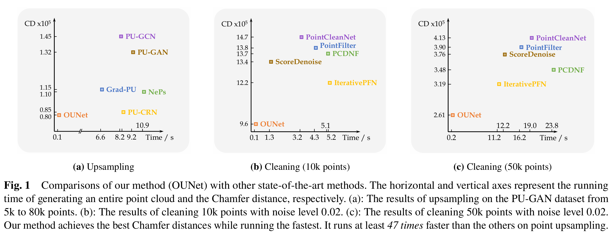

# Joint Point Cloud Upsampling and Cleaning with Octree-based CNNs


**[Joint Point Cloud Upsampling and Cleaning with Octree-based CNNs](https://arxiv.org/abs/2410.17001)**  
Authors: Jihe Li, Bo Pang, Peng-Shuai Wang  
Accepted by Computational Visual Media 




## Installation
1. Install Conda and create a conda environment.

    ``` bash
    conda create -n ounet python=3.10
    conda activate ounet
    ```

2. Intall PyTorch-2.1.0 with conda according to the official documentation.

    ``` bash
    conda install pytorch torchvision torchaudio pytorch-cuda=12.1 -c pytorch -c nvidia
    ```

3. Install the requirements. 
    ``` bash
    pip install -r requirements.txt
    
    # For evaluation only
    conda install -c conda-forge point_cloud_utils==0.18.0
    ```

## Data Preparation
The official access addresses of the public data sets are as follows：
[PU-GAN](https://drive.google.com/file/d/1BNqjidBVWP0_MUdMTeGy1wZiR6fqyGmC/view),
[Sketchfab](https://drive.google.com/file/d/1VgHWsifcZ-SGQEno-NXAice4VjwDQWK4/view),
[PU1K](https://drive.google.com/file/d/1tnMjJUeh1e27mCRSNmICwGCQDl20mFae/view?usp=drive_link),
[PUNet](https://drive.google.com/file/d/1-TvHy3bvq8X1vI0ztwmmubDqhngRLQDu/view).

Place and unzip them into folder `original_dataset`. Run the following commands to prepare dataset.
    
    bash tools/prepare_dataset.sh

## Trained Model

We trained our network on aforementioned four datasets, please download the trained weight via [Google Drive](https://drive.google.com/file/d/1xTd5HvDUQ5MVsG9db8K_f6bD8C5dkH-Y/view?usp=sharing) or [Baidu Netdisk](https://pan.baidu.com/s/1Kx4LVbB3mk01S3Qe4QRzNg?pwd=9ifh), and please it in the folder `logs/puc/checkpoints`.

## Train
Run the following commands to train the network by 4 GPUs. The log and trained model will be saved in the folder `logs/upsample-clean`.

    python main.py --config=configs/upsample-clean.yaml

## Inference
Run the following commands to generate upsampled and cleaned point clouds, which will be saved in the folder `logs/puc/model_outputs`.

    python main.py --config=configs/upsample-clean.yaml SOLVER.run evaluate

## Evaluate

Run the following commands to evaluate the upsampling results using CD, HD, and P2F. The `dataset` includes `PU-GAN`, `Sketchfab`, `PU1K`.

    python evaluate.py --outputdir=logs/upsample-clean/model_outputs/upsampling/<dataset> --dataset=<dataset>

Run the following commands to evaluate the cleaning results using CD, HD, and P2F. The `resolution` includes `10k` and `50k`, and the `noise level` includes `1`, `2`, `25`.

    python evaluate.py --outputdir=logs/upsample-clean/model_outputs/cleaning/<resolution>/noise_<noise level> --dataset=PUNet_<resolution>

## Citation
   ```bibtex
    @article{li2024joint,
    title={Joint Point Cloud Upsampling and Cleaning with Octree-based CNNs},
    author={Li, Jihe and Pang, Bo and Wang, Peng-Shuai},
    journal={arXiv preprint arXiv:2410.17001},
    year={2024}
    }
   ```